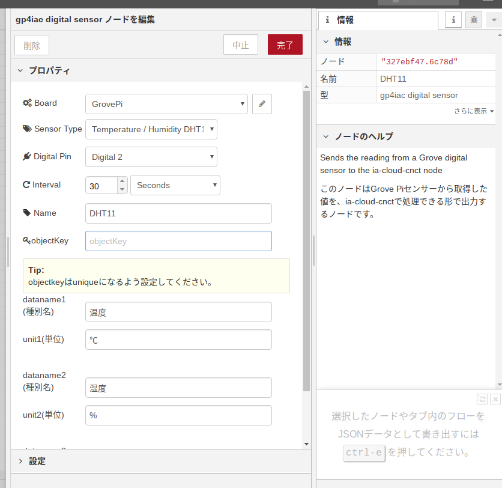

# GrovePI のセンサーから取得した値を ia-cloud-cnct Node で処理できる形式で出力するNode

## gp4iac

## 機能概要

このノードは、RaspberryPIに接続されたGrove Piの各種センサーの値を取得し、「ia-cloud-cnct」で処理できる形式でmsg出力をする。

#### 動作方法について：

GrovePiで取得したいセンサーの情報をプロパティで指定する。取得した値は「ia-cloud-cnct」形式のjasonに変換して出力される。

#### インストール時の注意点

インストール時に「npm WARN lifecycle ～」のエラーが出る場合は、インストール時のオプションに「--unsafe-perm」を指定する。

```
例.
sudo npm install --unsafe-perm ~/node-red-contrib-ia-cloud-fds/gp4iac
```


## 対応するセンサーの種類

* DHT11(温湿度センサー)：
* Ultrasonic Range(超音波測距センサー)：
* Button(Buttonセンサー)：


## プロパティー

本Nodeは以下のプロパティを持つ

| 名称         |       種別       | 説明                                                         |
| ------------ | :--------------: | ------------------------------------------------------------ |
| Board        | string<br />list | Configの種類を選択<br />通常は'GrovePi'をConfigノードに追加して選択 |
| Sensor Type  |      string      | センサータイプを選択                                         |
| Digital Pin  |       list       | センサーをつないでいるPin番号を選択                          |
| Interval     |  Int<br />list   | 繰り返し時間の設定<br />数値と単位を選択                     |
| Name         |      string      | Nodeの名称                                                   |
| objectKey    |      string      | DB登録時のKey<br />データ判別のため、Uniqueになるように設定する |
| dataname1～3 |      string      | センサーで計測する対象の種類<br /><br />※以下は選択時の自動入力(任意で変更可能)<br />DHT11(温湿度センサー)：<br />        dataname[0] = "温度";<br/>        dataname[1] = "湿度";<br/>        dataname[2] = "ヒートインデックス";<br />    Ultrasonic Range(超音波測距センサー)：<br />        dataname[0] = "距離";<br />     Button(Buttonセンサー)：button<br />        dataname[0] = "ボタンセンサー"; |
| unit1～3     |      string      | 計測結果の単位<br /><br />※以下は選択時の自動入力(任意で変更可能)<br />DHT11(温湿度センサー)：<br />        unit[0] = "℃";<br/>        unit[1] = "%";<br/>        unit[2] = "HI";<br />    Ultrasonic Range(超音波測距センサー)：<br />        unit[0] = "cm";<br />    Button(Buttonセンサー)：button<br />        unit[0] = "is_pressed"; |



## 出力メッセージ

* ``msg``:  **object**
  * 取得した値を配列に格納する。

| 名称      | 種別   | 説明                                                         |
| --------- | ------ | ------------------------------------------------------------ |
| timestamp | string | タイムスタンプ(isodatetime)<br />※入力メッセージのtimestampではなく、本ノード内で新たに取得したtimestamp。 |
| objectkey | string | 利用者                                                       |
| dataname  | string | センサータイプに応じた取得データ名称                         |
| datavalue | string | センサーが取得した値                                         |
| unit      | string | センサーが取得した値に応じた単位                             |


```
msg = {
    "request": "store",
    "dataObject": {
        "objectType" : "iaCloudObject",
        "objectKey" : {objectkey} ,
        "objectDescription" : "センサーの値",
        "timestamp" :  {timestamp},
        "ObjectContent" : {
            "contentType": "iaCloudData",
            "contentData":[{
                "dataName": "{dataname[0]}",
                "dataValue": {datavalue[0]},
                "unit": "{unit[0]}"
            },{
                "dataName": "{dataname[1]}",
                "dataValue": {datavalue[1]},
                "unit": "{unit[1]}"
            },{
                "dataName": "{dataname[2]}",
                "dataValue": {datavalue[2]},
                "unit": "{unit[2]}"
            }]
        }
    }
}


```

